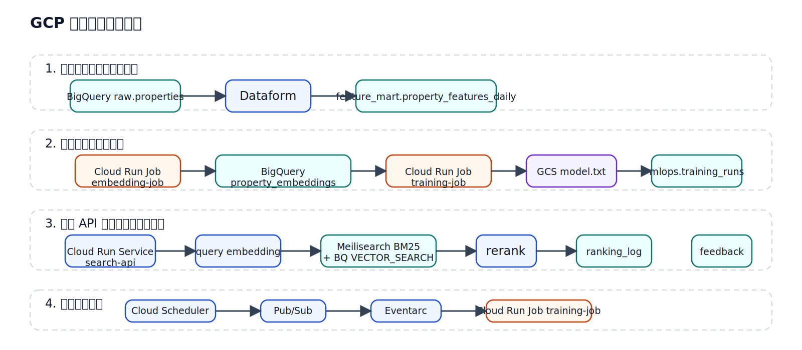
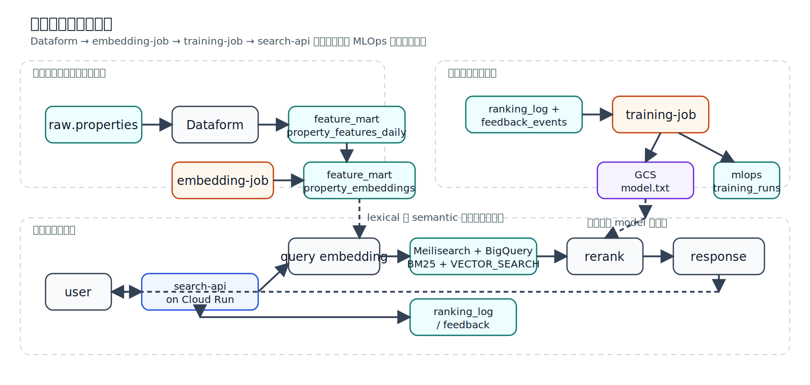
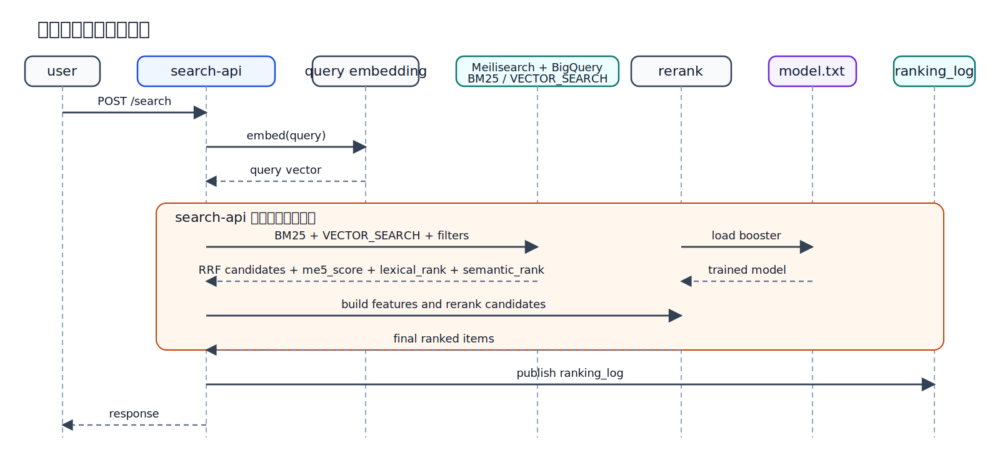

# GCP-ML入門

## Cloud Run + BigQuery で学ぶ MLOps パイプライン

**対象**
`/home/ubuntu/repos/study-gcp-mlops/study-gcp-mlops-bq-first` を読む IT エンジニア

**この動画で扱うこと**
- `bq-first` の MLOps パイプライン全体像
- GCP の各技術がどの工程を担当するか
- 実装済みコードをどう読むか

---

## 前提とゴール

### 前提
- ML の基本用語は既知
- `特徴量`, `推論`, `再学習` は説明済み

### この動画のゴール
1. MLOps パイプラインの工程を順に説明できる
2. GCP の各技術がどこで関与するか整理できる
3. `Dataform`, `BigQuery`, `Cloud Run`, `Pub/Sub` の関係を理解する

> ML 基礎の復習ではなく、GCP 上での実装の読み解きに集中します。

---

## この教材の位置付け

**題材**
- 不動産検索を例にした MLOps パイプライン
- 物件データは `BigQuery`
- API は `Cloud Run`
- 学習済みモデルは `GCS`

**この教材で強調する点**
- GCP 上で完結する軽量 MLOps
- `Vertex AI` を使わずに組む構成
- データ加工、学習、推論、監視、再学習を 1 本の導線で見る

---

## フェーズ別技術スタック整理

| 軸 | Phase 1: ML基礎 | Phase 2: ハイブリッド検索 Local | Phase 3: ハイブリッド検索 GCP |
|---|---|---|---|
| テーマ | カリフォルニア住宅価格予測 | 不動産検索(検証) | 不動産検索(実務) |
| 実行環境 | Local (`WSL` + `Docker Compose`) | Local (`WSL` + `Docker Compose`) | GCP (`Cloud Run`) |
| ML モデル | LightGBM (回帰) | LightGBM (reranker) | LightGBM LambdaRank (reranker) |
| 埋め込み | - | `multilingual-e5` | `multilingual-e5-base` |
| Lexical 検索 | - | Meilisearch (`BM25`) | Meilisearch (`BM25`) on Cloud Run |
| Vector 検索 | - | PostgreSQL (`DOUBLE PRECISION[]` + Python cosine、`pgvector` 不使用) | BigQuery `VECTOR_SEARCH` |
| データストア | PostgreSQL | PostgreSQL | BigQuery |
| API | - | FastAPI | FastAPI on Cloud Run |
| キャッシュ | - | Redis (`TTL 120s`, graceful fallback) | `cachetools.TTLCache` (in-memory) |
| IaC / デプロイ | Docker Compose | Docker Compose | Terraform + Cloud Run + WIF |

> Phase 3 は、Phase 2 の検索思想を保ったまま、実行基盤を GCP 向けに置き換えた構成です。

---

## MLOps パイプラインの全体像

### 工程
1. 生データを受ける
2. 特徴量を作る
3. 埋め込みを作る
4. 学習してモデルを保存する
5. API で推論する
6. ログとフィードバックを集める
7. 条件に応じて再学習する

> まず工程を押さえてから、各工程を GCP のどの技術が担当するかを見るのが理解しやすい順番です。

---

## なぜ Cloud Run と BigQuery を主役にするか

### Cloud Run の役割
- API をすぐ出せる
- Job と Service を同じ考え方で運用できる
- 小さく始めて伸ばしやすい

### BigQuery の役割
- 物件マスタ、特徴量、ログを一箇所に集約できる
- semantic 候補抽出と特徴量参照を同じ基盤で扱える
- 運用確認も SQL で追いやすい

### ねらい
- Phase 2 の検索体験を保ったまま GCP 化する

---

## GCP 技術と工程の対応

| 工程 | 主な技術 | 役割 |
|---|---|---|
| 生データ保管 | BigQuery | `raw.properties` とログの置き場 |
| 特徴量加工 | Dataform + BigQuery | `feature_mart` を生成 |
| 埋め込み生成 | Cloud Run Jobs + GCS | `embedding-job` がモデルを使って埋め込み生成 |
| 学習 | Cloud Run Jobs + BigQuery + GCS | `training-job` が学習し成果物を保存 |
| 推論 API | Cloud Run Service + BigQuery + Meilisearch | `search-api` が lexical + semantic + fuse + rerank を実行 |
| ログ収集 | Pub/Sub + BigQuery | ranking / feedback を蓄積 |
| 再学習起動 | Scheduler + Pub/Sub + Eventarc | 条件判定から job 起動までを連携 |



---

## 採用技術の役割分担

| レイヤ | 技術 | この教材で見る役割 |
|---|---|---|
| API | FastAPI on Cloud Run | `/search`, `/feedback`, `/jobs/check-retrain` |
| Lexical Search | Meilisearch on Cloud Run | `BM25` による lexical 候補抽出 |
| Data / Semantic Search | BigQuery | 物件、特徴量、ログ、`VECTOR_SEARCH` |
| Feature | Dataform | 特徴量テーブルの整形 |
| Embedding | multilingual-e5-base | クエリと物件の意味表現 |
| Ranking | LightGBM LambdaRank | 最終順位の最適化 |
| Cache | `cachetools.TTLCache` | `search-api` 内の in-memory TTL cache |
| Artifact | GCS | encoder / booster の配置 |
| Trigger | Pub/Sub, Eventarc, Scheduler | フィードバックと再学習起動 |

---

## 全体アーキテクチャ



> MLOps パイプラインは、単一 API ではなく、工程ごとに別コンポーネントへ分割されています。

---

## データ加工の流れ

### 入力
- `raw.properties`
- `mlops.search_logs`
- `mlops.feedback_events`

### Dataform で作るもの
- `feature_mart.properties_cleaned`
- `feature_mart.property_features_daily`
- assertions による品質チェック

### 重要
- 学習側も推論側も、同じ特徴量定義を前提にする
- そのため SQL と Python を lockstep で保つ

---

## 埋め込み生成の流れ

### 物件側
1. `embedding-job` が物件テキストを読む
2. `passage:` prefix を付けて埋め込みを作る
3. `feature_mart.property_embeddings` に保存する

### クエリ側
1. `search-api` が検索文を受け取る
2. `query:` prefix を付けて埋め込みを作る
3. Meilisearch (`BM25`) と BigQuery `VECTOR_SEARCH` の両方に使う

### ねらい
- 重い物件側はバッチ
- 軽いクエリ側だけオンライン
- lexical と semantic を同時に走らせる

---

## 推論工程の入口

`app/src/app/schemas/search.py`

```python
class SearchRequest(BaseModel):
    query: str
    limit: int = 10
    max_rent: int | None = None
    layout: str | None = None
    max_walk_min: int | None = None
    pet_ok: bool | None = None
```

### 見るポイント
- フリーワードと構造化条件を同時に受ける
- 候補抽出は `Meilisearch + BigQuery`
- 最終返却前に rerank の余地がある

---

## 推論工程の処理順

1. Cloud Run 上の `search-api` がリクエストを受ける
2. クエリを `E5` で埋め込む
3. Meilisearch (`BM25`) で lexical 候補を取る
4. BigQuery `VECTOR_SEARCH` で semantic 候補を取る
5. `RRF` で 2 系統を融合する
6. `build_ranker_features` で特徴量を作る
7. `LightGBM` があれば rerank する
8. `ranking_log` を Pub/Sub に流す
9. API 応答を返す



> 推論工程だけを切り出しても、埋め込み、2 系統検索、RRF 融合、特徴量生成、rerank の複数段があります。

---

## 候補抽出は 2 系統で行う

### ここでやっていること
- `BM25` による lexical 検索
- ベクトル近傍検索
- 家賃や間取りなどの属性フィルタ
- `RRF` による候補統合

### この構成の意味
- Phase 2 と同じ「lexical + semantic」の学習ポイントを維持する
- lexical は Meilisearch、semantic は BigQuery に役割分担する
- 統合後の特徴量参照とログ分析は BigQuery に寄せる

> Phase 3 では、Meilisearch on Cloud Run と BigQuery `VECTOR_SEARCH` を `RRF` でまとめる構成です。

---

## 再ランキングの役割

### LightGBM に渡す主な特徴量
- `rent`
- `walk_min`
- `age_years`
- `area_m2`
- `ctr`
- `fav_rate`
- `inquiry_rate`
- `me5_score`
- `lexical_rank`
- `semantic_rank`
- `rrf_rank`

### 重要
- `me5_score` だけで順番を決めない
- lexical / semantic / fused rank と物件属性をまとめて最終順位に落とす

---

## モデルが無いときも API は動く

### Phase 4 の考え方
- booster 未配置でも `/search` は返す
- `final_rank = lexical_rank` で最低限の検索を成立させる
- rerank は後から bolt-on できる

### 教材としての意味
- 候補抽出と rerank を分けて理解できる
- API 単体の疎通確認がしやすい

---

## ログとフィードバックの工程

### 返した後に何を残すか
- `ranking_log`
- `feedback_events`
- `training_runs`

### これでできること
- オフラインで NDCG を再計算
- どの順位で返したか追跡
- 再学習条件の判定

> MLOps では、推論結果を次の学習へ返すループが重要です。

---

## 再学習の工程

### 起点
- `Cloud Scheduler` が日次で `/jobs/check-retrain` を叩く

### 条件
- フィードバック件数が閾値を超える
- NDCG が悪化する
- 一定日数学習が走っていない

### 発火後
- `Pub/Sub retrain-trigger`
- `Eventarc`
- `training-job`

---

## Cloud Run が担う工程

### Service
- `search-api`
- 推論工程の入口

### Jobs
- `embedding-job`
- `training-job`
- 埋め込み生成と学習を担当

### MLOps 上の利点
- オンライン推論とバッチ処理を同じ実行基盤に寄せられる
- Docker, IAM, デプロイの考え方をそろえられる
- 「推論だけ別基盤」という分断を避けられる

---

## デモで見るべき観点

### コード
- `app/src/app/entrypoints/api.py`
- `app/src/app/services/ranking.py`
- `app/src/app/adapters/candidate_retriever.py`
- `app/src/app/adapters/lexical_search.py`
- `app/src/app/adapters/cache_store.py`
- `jobs/src/training/entrypoints/rank_cli.py`

### GCP / データ
- `mlops.training_runs`
- `feature_mart.property_embeddings`
- `mlops.ranking_log`
- `mlops.feedback_events`

---

## この教材で押さえるべきこと

1. MLOps は工程の連結であり、1 つの API ではない
2. `BigQuery` は保存、特徴量、候補抽出、ログ分析を横断して使う
3. `Cloud Run` は推論とバッチ学習の両方を支える
4. `Pub/Sub`, `Scheduler`, `Eventarc` が再学習ループをつなぐ

> GCP 上での MLOps は、各技術の担当工程を明確にして初めて全体像が見えます。

---

## まとめ

- `Cloud Run + BigQuery` を中心にした軽量 MLOps を扱った
- 重要なのは API 単体ではなく、データ加工から再学習までのパイプライン全体
- GCP の各技術は、それぞれ別工程を担当しながら 1 つの運用ループを作っている

### 次の一歩
- `make ops-search`
- `make ops-ranking`
- `make ops-check-retrain`
- `mlops.training_runs` の中身確認
